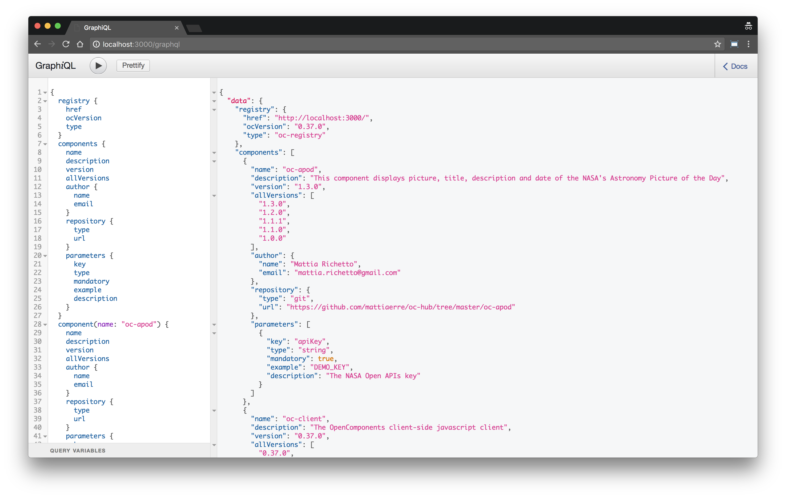

# oc-registry-graphql-express-middleware

OpenComponent Registry GraphQL Express middleware.

## How to install

```bash
yarn add oc-registry-graphql-express-middleware
```

## How to use it w/in your Registry

```javascript
// todo: get rid of babel-*
require('babel-core/register');
require('babel-polyfill');

const graphql = require('oc-registry-graphql-express-middleware');

registry.app.use('/graphql', graphql({ baseUrl: 'http://localhost:3000/', graphiql: true }));
```


