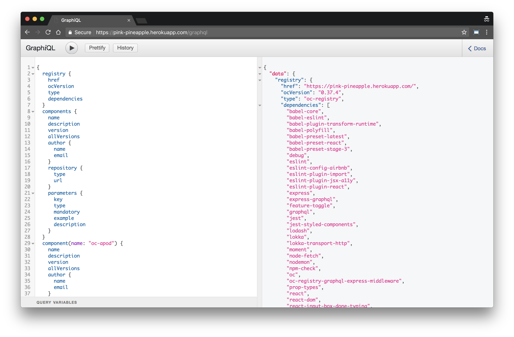

# oc-registry-graphql-express-middleware

[](https://greenkeeper.io/)

[](https://travis-ci.org/opencomponents/oc-registry-graphql-express-middleware)

OpenComponents Registry GraphQL Express middleware.

## How to install

```bash
npm add oc-registry-graphql-express-middleware
```

## How to use it w/in your Registry

```javascript
require('babel-core/register');
require('babel-polyfill');

const graphql = require('oc-registry-graphql-express-middleware');

const options = {
  baseUrl: configuration.baseUrl,
  graphiql: configuration.discovery,
  dependencies: configuration.dependencies
};

registry.app.use('/graphql', graphql(options));
```

> N.B.: `configuration` in the example above is the object used to configure the OpenComponents Registry


